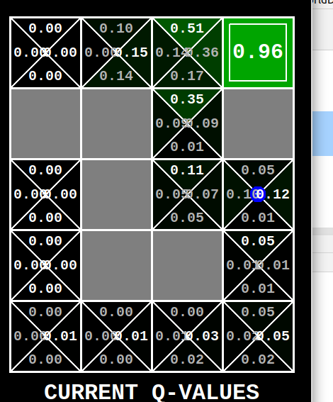

<h1> Reinforcement Learning </h1>
This is the group project for CSE 571 by Andrew Xi, Ryan Kittle, Anirudh Kaushik, and Vinayak Kothari.
This final project is part of our course CSE 571 at ASU and is adapted from CS188 UC Berkeley. There are multiple games in this project like Pacman, Maze Solver and Crawler. Our task is to train our agent to solve this problem with a good score and intelligently like a human would do. 
Main files in this project are :
qlearningAgents.py:Q-learning, TrueOnline Sarsa, Episodic Semi Gradient agents for Gridworld, Crawler and Pacman.
learningAgents.py: Defines the baseclasses ValueEstimation Agent and QLearningAgent,
Gridworld.py: The Gridworld implementation.
featureExtractors.py : Classes for extracting features on (state, action) pairs.Used for the approximate Q-learning agent (in qlearningAgents.py ).

For that we use Reinforcement Learning methods, mainly Q Learning, TrueOnlineSarsa and Episodic SemiGradient Sarsa with linear function approximation. Features used in the program are n-step BFS to search ghost location, closest food , power pallet, scared ghost location and  height and width of grid, location of agent, and current state, which is the image of the grid that is visible to the agent to make all decisions. Agent needs to update weights of the features based on state for making the next move. 

	QLearning: It is an off Policy Learning method where the next action is based on the epsilon greedy policy, which is the state which agent will be going after taking an action with epsilon probability and following a greedy policy from that new state. With 1-epsilon, agent will take random action.  Here epsilon greedy is used to make balance between exploration and exploitation. 
	Episodic SemiGradient: Improving upon the general Sarsa algorithm, episodic semi-gradient one step Sarsa adds the gradient term (∇q̂(S t , A t , w t )) which is the partial derivative of the Q function with respect to w. This extra term in the update function allows for the agent to take into account its most recent action when deciding its next action. With this, the agent can determine how effective its previous action was, and use this value to maximize the reward for its next decision.
	True Online SarsaLamda: It is an online method which updates all previous weights based on a single step action using eligibility traces. It is an online version of the lambda return algorithm.  It converges very fast and weight updates happen during episode running not only after episode ends, which is the main reason for it’s fast convergence as compared to Q learning and Episodic semi gradient. We use lambda here to control for how many states do we need to update values.

To run the code use the following command for Pacman Game

python pacman.py -p TrueOnlineSarsaLamda -a extractor=SimpleExtractor -x 500 -n 550 -l originalClassic -f -q

Options:

    -a: You can specify the extractor as SimpleExtractor or ImprovedExtractor

    -l: You can specify the map as originalClassic, mediumClassic, powerClassic, or any other map

    -p: You can specify the agent as EpisodicSemiGradient, TrueOnlineSarsaLamda, or ApproximateQAgent

For gridWorld :

python gridworld.py -a q -k 10 -n 0.2 -g MazeGrid -e 0.5 -w 100

Options :

			-a : Agents ( q for q learning, s for sarsa agent, slamda for sarsa lambda agent)
			-n : for noise
			-e : for epsilon
			-k : number of training iteration

Here are two images attached for gridworld where first image is of Q Learning with Linear function approximation, here image is after 10 episodes still we can see many state action value are 0, whichh means 
many value have not been updated and we dont know how good is this state action. This is not near to convergence and here state action value is updated after episode is complete
Second image is of True Online Sarsa Agent with linear function approximation and after 10 iteration we see that all important state action are updated because this agent updates values during iteration also.
THese values are near convergence
Here we can see major advantage of TrueOnline Sarsa Lamda over Q learning methods.
