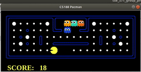

<h1> Reinforcement Learning </h1>

 

This final project is part of our course CSE 571 at ASU and is adapted from CS188 UC Berkeley. 
There are multiple games in this project like Pacman, Maze Solver and Crawler. 
Our task is to train our agent to solve this problem with a good score and intelligently like a human would do.   
Main files in this project are : 
qlearningAgents.py:Q-learning, TrueOnline Sarsa, Episodic Semi Gradient agents for Gridworld, Crawler and Pacman.  
learningAgents.py: Defines the baseclasses ValueEstimation Agent and QLearningAgent,  
Gridworld.py: The Gridworld implementation. 
featureExtractors.py : Classes for extracting features on (state, action) pairs. 

For that we use Reinforcement Learning methods, mainly Q Learning, TrueOnlineSarsa and Episodic SemiGradient Sarsa with linear function approximation. Features used in the program are n-step BFS to search ghost location, closest food , power pallet, scared ghost location and  height and width of grid, location of agent, and current state, which is the image of the grid that is visible to the agent to make all decisions. Agent needs to update weights of the features based on state for making the next move.  

	QLearning: It is an off Policy Learning method where the next action is based on the epsilon greedy policy, which is the state which agent will be going after taking an action with epsilon probability and following a greedy policy from that new state. With 1-epsilon, agent will take random action.  Here epsilon greedy is used to make balance between exploration and exploitation.  
	Episodic SemiGradient: Improving upon the general Sarsa algorithm, episodic semi-gradient function allows for the agent to take into account its most recent action when deciding its next action. With this, the agent can determine how effective its previous action was, and use this value to maximize the reward for its next decision.  
	True Online SarsaLamda: It is an online method which updates all previous weights based on a single step action using eligibility traces. It is an online version of the lambda return algorithm.  It converges very fast and weight updates happen during episode running not only after episode ends, which is the main reason for it’s fast convergence as compared to Q learning and Episodic semi gradient. We use lambda here to control for how many states do we need consider to update values.  

To run the code use the following command for Pacman Game

python pacman.py -p TrueOnlineSarsaLamda -a extractor=ImprovedExtractor -x 500 -n 550 -l originalClassic

Options:

    -a: You can specify the extractor as SimpleExtractor or ImprovedExtractor

    -l: You can specify the map as originalClassic, mediumClassic, powerClassic, or any other map

    -p: You can specify the agent as EpisodicSemiGradient, TrueOnlineSarsaLamda, or ApproximateQAgent

For gridWorld :

python gridworld.py -a q -k 10 -n 0.2 -g MazeGrid -e 0.5 -w 100

Options :

			-a : Agents ( q for q learning, s for sarsa agent, slamda for sarsa lambda agent)
			-n : for noise
			-e : for epsilon
			-k : number of training iteration
 <t /> 

Here are two images attached for gridworld where the first image is of Q Learning with Linear function approximation and second image is of TrueOnline Sarsa lamda.
Initially Q learning completed it's first iteration faster than TrueOnline Sarsa Lamda but after TrueOnline Sarsa Lamda completes it's first iteration it updates values of all states which were visited to reach terminal state. But in  Q learnining, Q values update depend only on next state and it updates after iteration episode is completed in each episode. Once reaching terminal state in first episode TrueOnline Sarsa Lambda updates it's Q values during iteration also.  

Here we can see the major advantage of TrueOnline Sarsa Lambda over Q learning methods.
